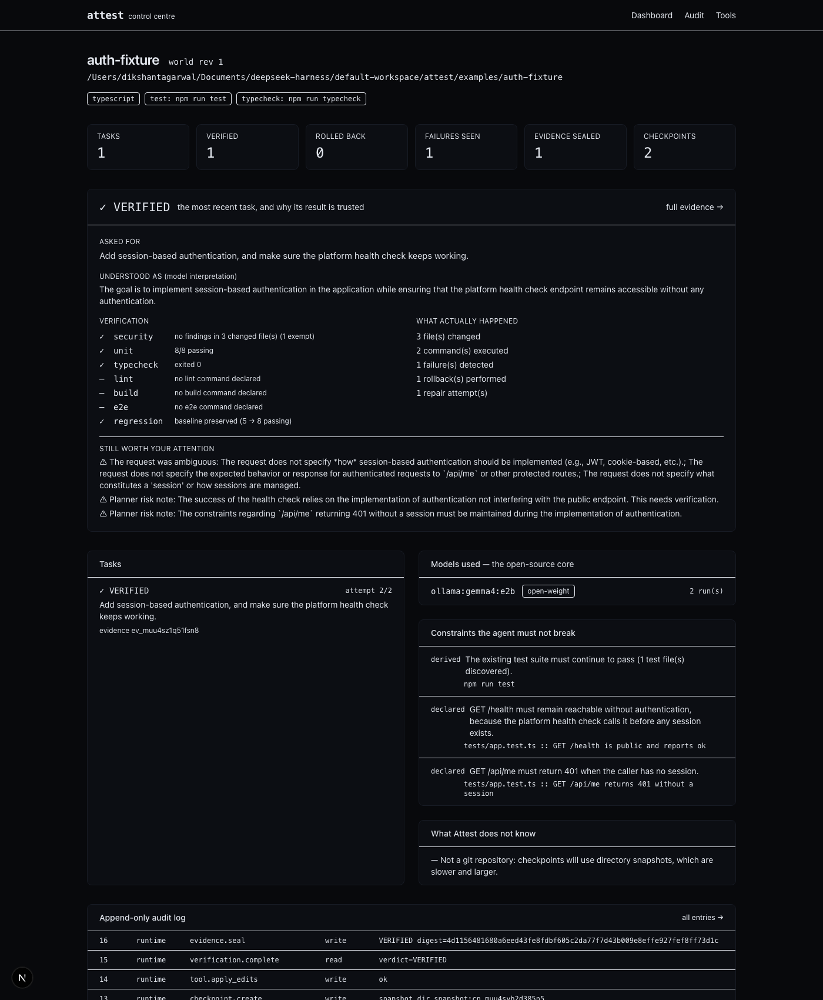
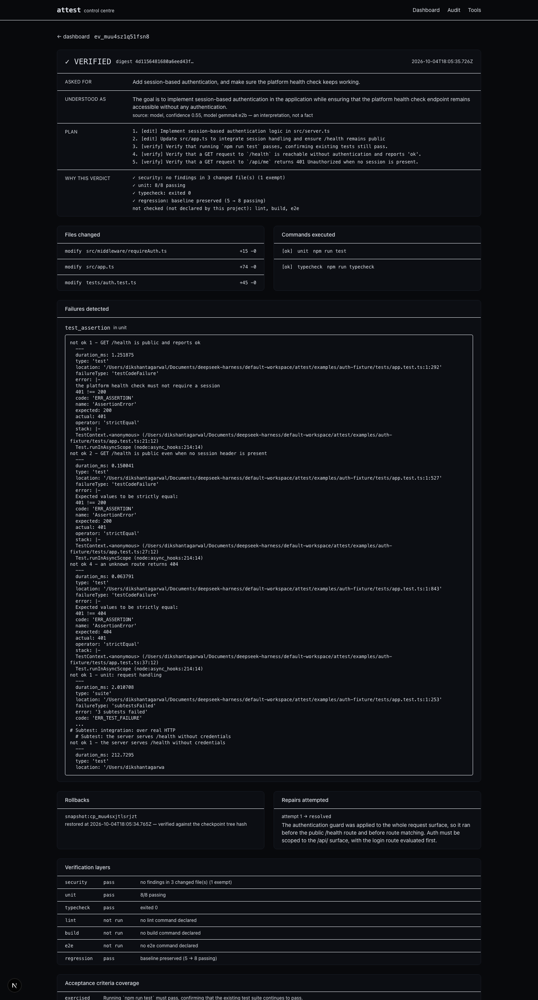

<div align="center">

# Attest

**An autonomous engineering runtime that will not say "done".**

It says *verified*, or it rolls back and tells you why.

`persistent project world` · `checkpointed execution` · `multi-layer verification` · `enforced rollback` · `sealed evidence`

</div>

---

## The problem

A developer delegating work to an AI agent does not stop working. They become the **human
orchestration layer**: re-explaining the architecture to each new agent, restoring lost context,
re-deriving why last week's decision was made, and — above all — verifying that "Done" is
actually done.

The bottleneck is not code generation. **It is trust and continuity.**

Existing agents are genuinely good at producing changes. What they do not give you is justified
confidence that a change is safe to keep, or a cheap way to undo it when it isn't. So the
developer runs the tests, reads the diff, finds what broke, and reverses it by hand. That is the
work Attest takes over.

## What Attest does

```
INTENT → INTERPRET → PLAN → BASELINE → CHECKPOINT → EXECUTE → VERIFY
                                                        │
                                              ┌─── fails ───┐
                                              ↓             │
                                          ROLLBACK → DIAGNOSE → REPAIR
                                              │                   │
                                              └───── re-verify ───┘
                                                        │
                                                    EVIDENCE
```

Five properties are enforced in code, not by convention:

| Property | How it is enforced |
|---|---|
| **Nothing mutates outside a checkpoint** | The loop creates a checkpoint before every attempt. There is no code path that writes first. |
| **A verdict is never authored by a model** | `computeVerdict()` is a pure function over executed layer results. Models influence the *inputs*; they cannot write the verdict. |
| **A failed attempt is rolled back before it is repaired** | The repair prompt is built from a workspace that has *already* been restored to known-good, and the restore is verified by tree hash. |
| **Absence of evidence is never success** | A required layer that could not run produces `UNVERIFIED`, not `VERIFIED`. |
| **Passing checks is not the same as doing the work** | An acceptance criterion naming a concrete surface that no test references caps the verdict at `PARTIALLY_VERIFIED`. |
| **Open-source AI is core, not decoration** | The router **refuses** models whose weights are not open by default. Opting out requires `ATTEST_ALLOW_PROPRIETARY=1`. |

## The evidence record

Every task ends with a sealed, digest-protected record answering the only question that matters:

> Why should I believe you?

```
Task          →  ask a real engineering task
 ├── intent          your words, verbatim
 ├── interpretation  what it understood — labelled as interpretation, not fact
 ├── plan            what it intended to do
 ├── changes         what actually changed (from the tool runtime's own records)
 ├── commands        what actually ran, with exit codes
 ├── tools           which tools, at which permission level
 ├── models          which models, with weight class so openness is auditable
 ├── tests           real counts parsed from the runner's output
 ├── failures        what went wrong, with the real assertion text
 ├── repairs         each attempt and whether it resolved
 ├── rollbacks       each restore, and whether it was verified
 ├── verification    every layer: pass / fail / did not run
 ├── verdict         computed, with reasons
 └── residual risk   what you should still check yourself
```

The record is sealed with a digest. `attest verify` recomputes it — edit the record and the seal
breaks.

## Quick start

```bash
git clone <this repo> && cd attest
npm install

# Analyse a repository — this builds its Project World
node bin/attest.mjs init --dir examples/auth-fixture

# Run the scripted failure → rollback → repair → verify demonstration
node bin/attest.mjs demo --dir examples/auth-fixture

# Read the evidence it produced
node bin/attest.mjs evidence --markdown --diff
```

No API keys. No accounts. No network. The local model runs on your machine.

### Requirements

- Node.js ≥ 20.11
- [Ollama](https://ollama.com) with an open-weight model: `ollama pull gemma4:e2b`
- That's it. If Ollama is not running, Attest can use any OpenAI-compatible endpoint that serves an
  open-weight model (`ATTEST_GATEWAY_URL`), and it will say so in the evidence record.

## The demo

`attest demo` runs a real task against a real repository with a real test suite:

1. Reads the repo, discovers its commands and its **constraints** — including a human-declared one
   that `/health` must stay public.
2. Runs the repo's tests **before touching anything**, to establish a baseline. If the repo is
   already red, Attest says so and refuses to claim a regression.
3. Takes a reversible checkpoint.
4. Applies an authentication change that is *plausible and wrong*: the session guard runs before
   the public health route.
5. **Detects the failure** — the project's own tests fail.
6. **Rolls back**, and proves the restore with a tree hash.
7. **Diagnoses** from the actual assertion output.
8. **Repairs**: scopes the guard to the API surface.
9. **Re-verifies** — this time it passes.
10. **Seals an evidence record** and updates the Project World.

The recorded change sets are replayed so the demonstration is reproducible on any machine; the
detection, checkpointing, rollback, verification and evidence are the genuine runtime. See
[`docs/DEMO.md`](docs/DEMO.md) for the full disclosure of what is and is not scripted.

## CLI

```bash
attest init [--force]              # analyse a repo, create its Project World
attest analyze                     # re-analyse, merge new observations
attest task "<intent>"             # run one engineering task end to end
attest demo                        # the scripted recovery demonstration
attest status                      # world health, tasks, latest verdict
attest evidence [id] --markdown    # the human-readable trust report
attest verify                      # recompute an evidence seal
attest explain                     # plain-language account of the last task
attest rollback --task <id>        # human override: restore the pre-task state
attest checkpoints                 # list reversible checkpoints
attest models [--probe]            # models, policy, and measured capability
attest tools                       # the tool surface and permission levels
attest audit                       # append-only audit log
attest trace [--test]              # Sentry agent-tracing status; --test proves it works
```

Useful flags: `--max-attempts <n>`, `--dry-run`, `--offline`, `--no-review`,
`--yes-dangerous` (required for destructive tools), `--json`.

## Control centre



A read-only Next.js view over the Project World: task verdicts, the latest evidence record,
verification layers, acceptance-criteria coverage, model usage with weight class, constraints,
and the audit log.



```bash
cd apps/web && npm install
ATTEST_PROJECT_DIR=$(pwd)/../../examples/auth-fixture npm run dev   # http://localhost:3939
```

## How it is built

```
packages/
  shared/           domain types, hashing, diffing, atomic writes, process execution
  project-world/    repository analysis + the persistent world and audit log
  model-router/     provider abstraction; open-weight-first policy and fallback chain
  tool-runtime/     tool registry, permission model, path safety, checkpoints
  verification/     layered verification, test-output parsing, in-process security scan
  evidence/         evidence assembly, sealing, and human-readable rendering
  agent-runtime/    interpreter, planner, implementer, repairer, reviewer, the loop
  observability/    Sentry agent tracing (gen_ai.* spans), no-op without a DSN
  core/             AttestRuntime — the facade every interface is built on
  cli/              the primary interface
apps/web/           read-only control centre
examples/auth-fixture/   the demonstration target repository
```

**[`docs/ARCHITECTURE.md`](docs/ARCHITECTURE.md)** explains the design and the trade-offs.

## Verified, not claimed

```
npm run selftest      # typecheck + lint + 80 tests
```

A demonstration of the seal, in four commands:

```bash
attest verify                            # ✓ seal intact
# edit .attest/world.json by hand, then:
attest verify                            # ✗ SEAL BROKEN
```

`npm test` runs 80 tests, including end-to-end tests that prove the recovery loop against a real
repository with a real `node:test` suite: the regression is detected, the rollback is verified
byte-for-byte, the repair is applied, and further scenarios prove that when the repair *also* fails
the workspace is left exactly as it was found — and that a change passing every check while
implementing none of the request cannot come back `VERIFIED`.

## Observability

Tracing is opt-in and costs nothing when disabled — with no `SENTRY_DSN` the SDK is never even
imported, so Attest still runs with no network at all.

```bash
export SENTRY_DSN='https://…@…ingest.sentry.io/…'
attest trace --test        # sends one probe span and flushes it
```

| Span | Records |
|---|---|
| `gen_ai.invoke_agent` | one per task: final verdict, failure/repair/rollback counts, models used |
| `gen_ai.chat` | one per model call: model, provider, latency, tokens, schema validity, fallback |
| `gen_ai.execute_tool` | one per tool call: tool, permission level, whether it mutates |

Sentry's Node SDK does not auto-instrument Ollama, so these spans are written by hand against the
`gen_ai` semantic conventions. Repository contents, prompts and diffs are never attached to a span.

## Safety

- Destructive tools require explicit per-run human approval (`--yes-dangerous`).
- Every tool call passes a permission model, a timeout, and an audit record.
- File paths are resolved against the project root; escapes are refused before any I/O.
- Known-destructive commands are refused before a process is spawned.
- Connector content is framed as untrusted data, and the enforcement does not depend on the model
  obeying that framing.
- `attest rollback` is available at any time.

See [`docs/SECURITY.md`](docs/SECURITY.md) and [`docs/THREAT_MODEL.md`](docs/THREAT_MODEL.md).

## Honest limitations

- Verification is only as strong as the project's own checks. If a repository has no tests, Attest
  says so and the verdict will not be `VERIFIED`.
- The acceptance-criteria coverage check is a **heuristic**: it detects whether a test *references*
  the surface a criterion names, not whether the test asserts anything useful. It is a smoke alarm,
  and the record says so.
- The security layer is a focused, in-process rule set, not a substitute for a dedicated scanner.
- The web control centre is read-only; approvals happen through the CLI.
- Sessions, tasks and evidence live in a single JSON document under `.attest/`. That is a
  deliberate trade-off for a local tool, and the store interface is the seam for a database.
- MCP server and external-agent delegation are designed for but not shipped in this version.

## Documentation

| Document | What it covers |
|---|---|
| [`docs/PROBLEM_STATEMENT.md`](docs/PROBLEM_STATEMENT.md) | The problem, with falsifiable claims |
| [`docs/ARCHITECTURE.md`](docs/ARCHITECTURE.md) | The design and every trade-off behind it |
| [`docs/DECISIONS.md`](docs/DECISIONS.md) | 14 ADRs, including the decision that was wrong |
| [`docs/DEMO.md`](docs/DEMO.md) | The demonstration, and exactly what is scripted |
| [`docs/SECURITY.md`](docs/SECURITY.md) | What it protects, and what it does not |
| [`docs/THREAT_MODEL.md`](docs/THREAT_MODEL.md) | 12 abuse paths, each rated enforced / mitigated / accepted |
| [`docs/TESTING.md`](docs/TESTING.md) | What is tested and why |
| [`docs/RESEARCH.md`](docs/RESEARCH.md) | Reuse-before-build audit and the competitor gap |
| [`docs/SPONSOR_MATRIX.md`](docs/SPONSOR_MATRIX.md) | Sponsor technologies scored, with rejections recorded |
| [`docs/TASKS.md`](docs/TASKS.md) | The plan, and what was deliberately cut |
| [`docs/evidence/`](docs/evidence/) | Sealed evidence records from real runs, including a live failure |

## License

Apache-2.0. See [`LICENSE`](LICENSE) and [`THIRD_PARTY_NOTICES.md`](THIRD_PARTY_NOTICES.md).
